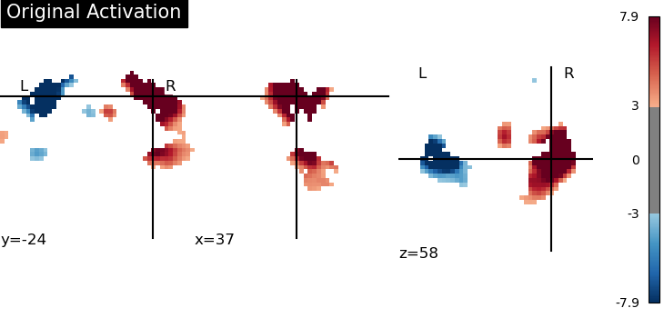
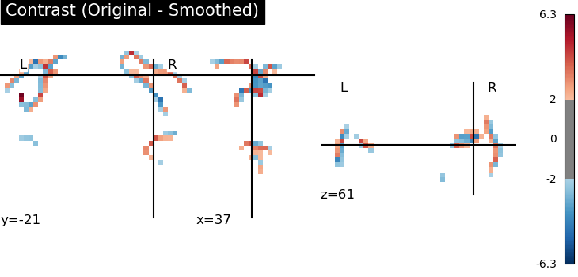

# First fMRI Visualization

This is my very first experiment visualizing fMRI data using Python and the [Nilearn](https://nilearn.github.io/) library.

## What this project does:
- Loads a sample motor activation image.
- Creates a simple "contrast" image by comparing the original with a smoothed version.
- Visualizes both images using Nilearn's `plot_stat_map`.

## Tools I used:
- Python 3
- Nilearn
- Jupyter Notebook (via Juno on iPad)

## Example Plots:
### Original Activation

### Contrast (Original - Smoothed)

---

*This is the start of my neuroimaging & coding journey – more to come!*
